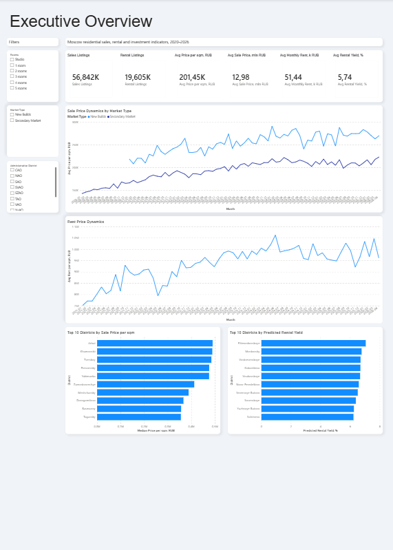
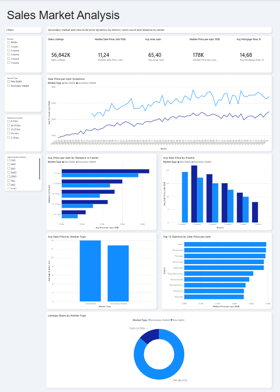
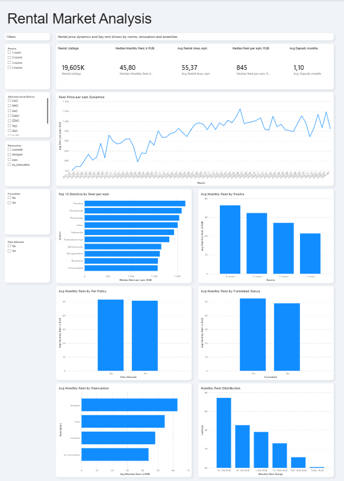
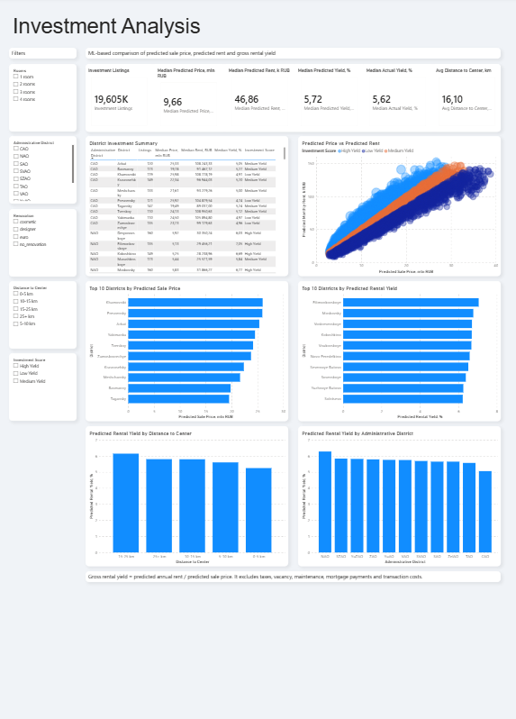
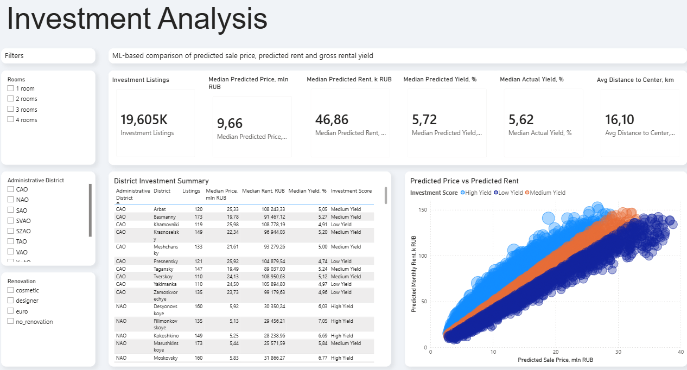
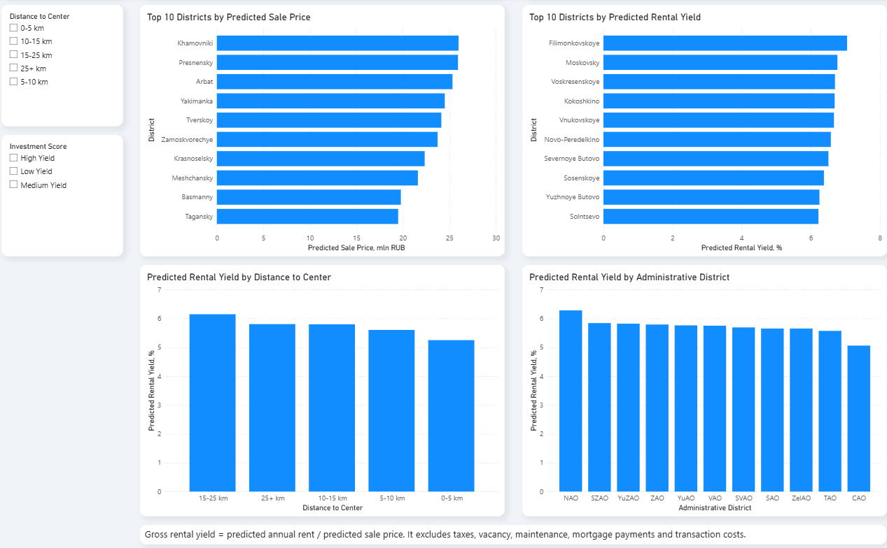

# Moscow Real Estate Intelligence

[English version](README.md)

End-to-end проект по анализу рынка жилой недвижимости Москвы за 2020–2026 годы.

Проект объединяет обработку данных на Python, разведочный анализ данных (EDA), машинное обучение (ML) и интерактивный дашборд в Power BI. Основная цель — изучить рынок продаж, аренды и потенциальной инвестиционной доходности по районам Москвы.

---

## О проекте

В проекте рынок недвижимости Москвы рассматривается с нескольких сторон:

* **Рынок продаж** — анализ цен вторичного рынка и новостроек по районам, количеству комнат и расстоянию до центра.
* **Рынок аренды** — анализ арендных ставок, влияния ремонта, меблировки, количества комнат и условий аренды.
* **Инвестиционный анализ** — оценка прогнозной цены продажи, прогнозной арендной платы и валовой арендной доходности на основе ML-моделей.
* **Дашборд в Power BI** — интерактивная панель для изучения ключевых показателей рынка.

Проект показывает полный путь аналитической работы: от сырых данных до очищенных таблиц, ML-моделей и готового дашборда.

---

## Превью дашборда

### Общий обзор рынка



### Анализ рынка продаж



### Анализ рынка аренды



### Инвестиционный анализ



### Детализация инвестиционного анализа



### Топ районов по инвестиционным показателям



---

## Данные

В проекте используется датасет Kaggle:

**Moscow Real Estate Sales & Rentals (2020–2026)**
https://www.kaggle.com/datasets/sergionefedov/moscow-real-estate-sales-and-rentals-20202026

Сырые данные не добавлены в репозиторий, потому что папка `data/raw/` исключена из Git.

Основные исходные файлы:

* `secondary_market.csv`
* `rentals.csv`
* `new_builds.csv`
* `metro_stations.csv`
* `district_prices_monthly.csv`

---

## Используемые технологии

* **Python**
* **pandas**
* **NumPy**
* **Matplotlib**
* **Seaborn**
* **scikit-learn**
* **Joblib**
* **Power BI**
* **Git / GitHub**

---

## Структура проекта

```text
moscow-real-estate-intelligence/
├── data/
│   ├── raw/                 # Сырые данные Kaggle, не загружаются в Git
│   ├── processed/           # Очищенные данные после обработки
│   └── powerbi/             # CSV-таблицы для Power BI
├── powerbi/
│   ├── screenshots/         # Скриншоты дашборда
│   └── moscow_real_estate_dashboard.pbix
├── reports/
│   ├── figures/             # Графики EDA и оценки моделей
│   └── tables/              # Таблицы, отчёты и метрики моделей
├── scripts/
│   ├── 01_check_data.py
│   ├── 02_basic_eda.py
│   ├── 03_prepare_clean_data.py
│   ├── 04_prepare_powerbi_tables.py
│   ├── 05_train_price_model.py
│   ├── 06_train_rent_model.py
│   └── 07_prepare_investment_predictions.py
├── requirements.txt
├── README.md
└── README_RU.md
```

---

## Процесс обработки данных

Проект построен как последовательность Python-скриптов.

### 1. Проверка данных

```bash
python scripts/01_check_data.py
```

Скрипт проверяет исходные CSV-файлы, структуру колонок, пропуски и базовую статистику.

### 2. Разведочный анализ данных

```bash
python scripts/02_basic_eda.py
```

Скрипт строит графики и сводные таблицы для рынка продаж, аренды и новостроек.

### 3. Очистка данных и создание признаков

```bash
python scripts/03_prepare_clean_data.py
```

Скрипт создаёт очищенные датасеты и новые признаки:

* год, месяц и квартал публикации объявления
* цена в млн рублей
* аренда в тыс. рублей
* цена и аренда за квадратный метр
* возраст здания
* признаки первого и последнего этажа
* группы расстояния до центра
* группы по количеству комнат
* статусы меблировки и разрешения животных
* тип рынка: вторичный рынок или новостройки

### 4. Подготовка таблиц для Power BI

```bash
python scripts/04_prepare_powerbi_tables.py
```

Скрипт создаёт аналитические CSV-таблицы, которые используются в дашборде Power BI.

### 5. Модель прогнозирования цены продажи

```bash
python scripts/05_train_price_model.py
```

Скрипт обучает модели для прогнозирования цены квартиры.

Проверяемые модели:

* базовая модель на медианном значении
* линейная регрессия
* случайный лес
* градиентный бустинг

### 6. Модель прогнозирования аренды

```bash
python scripts/06_train_rent_model.py
```

Скрипт обучает модели для прогнозирования ежемесячной арендной платы.

Проверяемые модели:

* базовая модель на медианном значении
* линейная регрессия
* случайный лес
* градиентный бустинг

### 7. Расчёт инвестиционных показателей

```bash
python scripts/07_prepare_investment_predictions.py
```

Скрипт объединяет прогнозную цену продажи и прогнозную арендную плату, рассчитывает валовую арендную доходность и присваивает объектам инвестиционную категорию.

Категории инвестиционной привлекательности:

* Low Yield (низкая доходность)
* Medium Yield (средняя доходность)
* High Yield (высокая доходность)

---

## Дашборд Power BI

Дашборд состоит из четырёх страниц.

### Общий обзор рынка

Страница с ключевыми показателями: количество объявлений, средние цены, средняя аренда, арендная доходность и топ районов.

### Анализ рынка продаж

Страница для анализа цен продажи по типу рынка, району, количеству комнат и расстоянию до центра.

### Анализ рынка аренды

Страница для анализа арендных ставок, влияния ремонта, меблировки, разрешения животных и сравнения районов.

### Инвестиционный анализ

Страница с ML-оценкой прогнозной цены продажи, прогнозной аренды, валовой арендной доходности и инвестиционной категории.

Файл дашборда находится здесь:

```text
powerbi/moscow_real_estate_dashboard.pbix
```

---

## Машинное обучение

В проекте решаются две отдельные задачи регрессии.

### 1. Прогнозирование цены продажи

Целевая переменная:

```text
price_rub
```

Используемые признаки включают площадь квартиры, количество комнат, этаж, район, станцию метро, расстояние до центра, тип рынка и другие характеристики.

### 2. Прогнозирование месячной аренды

Целевая переменная:

```text
monthly_rent_rub
```

Используемые признаки включают площадь квартиры, количество комнат, этаж, район, метро, расстояние до центра, характеристики здания и условия аренды.

После этого прогнозные значения используются для расчёта валовой арендной доходности:

```text
Валовая арендная доходность = прогнозная годовая аренда / прогнозная цена продажи
```

---

## Какие вопросы помогает исследовать проект

Проект помогает ответить на вопросы:

* В каких районах Москвы самая высокая цена за квадратный метр?
* Как отличаются новостройки и вторичный рынок?
* Как расстояние до центра влияет на цену и арендную доходность?
* В каких районах самая высокая прогнозная доходность от аренды?
* Как количество комнат, ремонт и меблировка влияют на арендную плату?
* Какие районы выглядят более привлекательными с инвестиционной точки зрения?

---

## Ограничения

Инвестиционный анализ использует **валовую арендную доходность**.

Эта метрика не учитывает:

* налоги
* периоды простоя квартиры
* расходы на обслуживание
* ипотечные платежи
* расходы на сделку
* ремонт
* расходы на управление недвижимостью

Валидация моделей сейчас основана на случайном разделении данных на обучающую и тестовую выборки. Для реального прогнозирования рынка недвижимости более корректно использовать временное разделение, потому что рынок меняется со временем.

Поэтому инвестиционную категорию стоит воспринимать как сравнительный аналитический показатель, а не как финансовую рекомендацию.

---

## Как запустить проект

### 1. Клонировать репозиторий

```bash
git clone https://github.com/k-tsoy/moscow-real-estate-intelligence.git
cd moscow-real-estate-intelligence
```

### 2. Создать и активировать виртуальное окружение

```bash
python -m venv .venv
```

Windows:

```bash
.venv\Scripts\activate
```

macOS / Linux:

```bash
source .venv/bin/activate
```

### 3. Установить зависимости

```bash
pip install -r requirements.txt
```

### 4. Скачать датасет

Скачать датасет с Kaggle и положить исходные CSV-файлы в папку:

```text
data/raw/
```

Нужные файлы:

```text
district_prices_monthly.csv
metro_stations.csv
new_builds.csv
rentals.csv
secondary_market.csv
```

### 5. Запустить скрипты

```bash
python scripts/01_check_data.py
python scripts/02_basic_eda.py
python scripts/03_prepare_clean_data.py
python scripts/04_prepare_powerbi_tables.py
python scripts/05_train_price_model.py
python scripts/06_train_rent_model.py
python scripts/07_prepare_investment_predictions.py
```

### 6. Открыть дашборд Power BI

Открыть файл:

```text
powerbi/moscow_real_estate_dashboard.pbix
```

Затем нажать:

```text
Refresh
```

---

## Статус проекта

Готово:

* проверка качества данных
* EDA
* очистка данных
* создание новых признаков
* ML-модели
* таблицы для инвестиционного анализа
* дашборд Power BI
* скриншоты дашборда

---

## Автор

Проект создан **Konstantin Tsoy (@k-tsoy)** как портфолио-проект по аналитике данных и машинному обучению.
